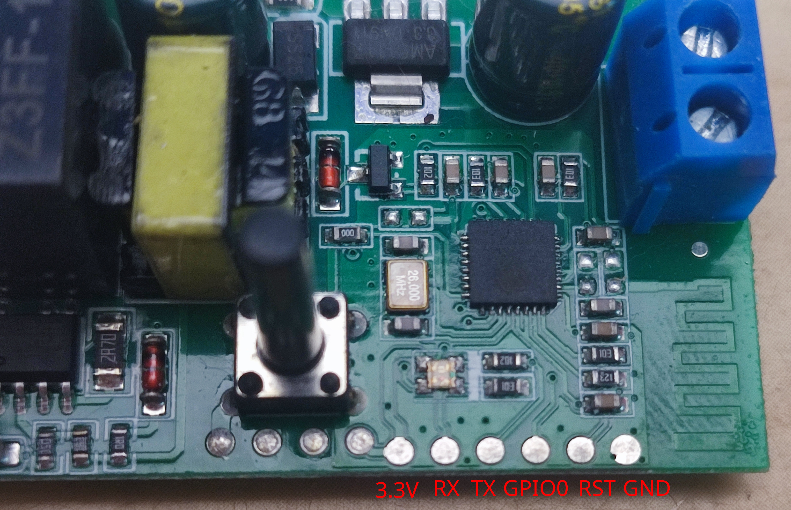

# ONiOFF Smart Switch Made for ESPHome

The ONiOFF smart switch is an ESP8285-based device with Tuya firmware. With a
small bit of soldering, it can be flashed to ESPHome (or Tasmota or any other
custom firmware).

## Versions

There is a generic switch, a fan, and a light version on the firmware available
for download or web flashing.

## Serial interface pins

With the button and solder pads closest to you, the pins are as follows, going
from left to right:

| Pin | Function |
| --- | -------- |
| 1   | 3.3V VCC |
| 2   | RXD      |
| 3   | TXD      |
| 4   | GPIO0    |
| 5   | Reset    |
| 6   | Ground   |

## GPIO

The relay, button, and LED GPIO pins are as follows:

| Pin | Component | Defaults                                    |
| --- | --------- | ------------------------------------------- |
| 1   | Blue LED  | Status light                                |
| 5   | Button    | Relay on click; factory reset on long press |
| 12  | Relay     | Normally open                               |

## Factory Reset

You can factory reset the device by enabling the `Factory Reset` button in Home
Assistant, using `Factory Reset` button on the built-in web interface, or holding
the physical button for 5-10 seconds.

## Notes

There is a Red LED which turns on when the relay is engaged. It is hardwired and
cannot be controlled in software.

## Installation

You can use the links below to download a pre-built firmware to upload manually.
You can also install a pre-built firmware directly to your device via USB from
the browser.

### Web flashing tool

[Access the firmware web flashing tool by clicking here](https://curtistinkers.github.com/esphome-onioff-smart-switch)

### Downloads

#### Generic Switch

The relay is configured as a generic switch that **does not** come back on after
power loss.

[Download ONiOFF Switch Over-the-Air binary file](https://curtistinkers.github.io/esphome-onioff-smart-switch/firmware/onioff-switch-esp8266.ota.bin)

[Download ONiOFF Switch Factory binary file](https://curtistinkers.github.io/esphome-onioff-smart-switch/firmware/onioff-switch-esp8266.factory.bin)

#### Light Switch

The relay is configured as a light that **always** comes back on after power loss.

[Download ONiOFF Light Switch Over-the-Air binary file](https://curtistinkers.github.io/esphome-onioff-smart-switch/firmware/onioff-switch-light-esp8266.ota.bin)

[Download ONiOFF Light Switch Factory binary file](https://curtistinkers.github.io/esphome-onioff-smart-switch/firmware/onioff-switch-light-esp8266.factory.bin)

#### Fan Switch

The relay is configured as a fan that **does not** come back on after power loss.

[Download ONiOFF Fan Switch Over-the-Air binary file](https://curtistinkers.github.io/esphome-onioff-smart-switch/firmware/onioff-switch-fan-esp8266.ota.bin)

[Download ONiOFF Fan Switch Factory binary file](https://curtistinkers.github.io/esphome-onioff-smart-switch/firmware/onioff-switch-fan-esp8266.factory.bin)
